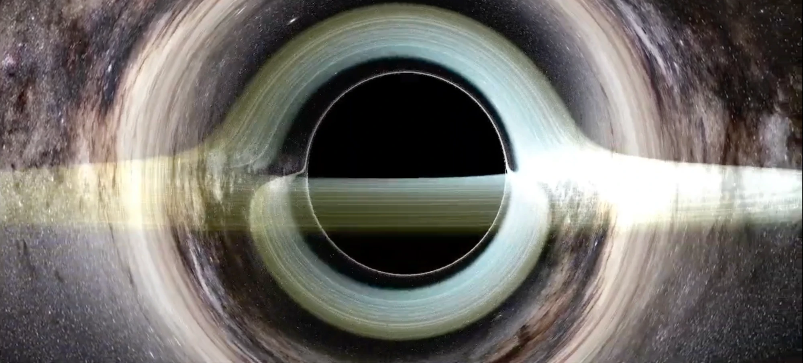

# Kerr Black Hole Render

Real-time black hole renderer in C++ and OpenGL 4.6, written from the geodesic equations up. Rays are traced as actual null geodesics of the Kerr metric in compute shaders (no raymarching approximations), rendering a gravitationally lensed accretion disk with physically derived color and brightness.

## Physics

Rays are traced backwards from the camera as null geodesics in Boyer-Lindquist coordinates. Each ray's conserved quantities (energy, angular momentum, Carter constant) are extracted by projecting the camera-space direction onto a local ZAMO tetrad, and the geodesic equations are then integrated with RK4 on the GPU. The polar equation is integrated in mu = cos(theta) rather than theta itself, which keeps the system regular at the poles where the standard form is singular.

The accretion disk runs from the ISCO to 20M, with the ISCO radius computed from the spin via the Bardeen-Press-Teukolsky formula, so spinning the black hole up visibly drags the disk's inner edge toward the horizon. Temperature follows the thin-disk profile T ~ r^(-3/4) and is mapped through a blackbody colormap. Each disk crossing carries a total shift factor g combining gravitational redshift and Doppler shift from the Keplerian orbital motion (with the sign of the angular momentum flipped relative to the physical photon, since the ray is traced backwards), applied to the temperature together with g^3 relativistic beaming. The approaching side of the disk comes out brighter and bluer, the receding side dimmer and redder, which is a natural consequence of the physics simulated.

Spin is adjustable live over a in [-0.998, 0.998]. Frame dragging, the asymmetric shadow, the photon ring, and the higher-order lensed images of the disk all fall out of the integration.

## Adaptive rendering with an error bound

Integrating every pixel is wasteful because the deflection field is smooth almost everywhere, but naive undersampling would destroy the features that matter (the photon ring is thin). Instead of guessing where the detail is, the renderer bounds the interpolation error:

1. A coarse pass integrates every 8th pixel, storing sky direction, disk crossings, and closest-approach radius.
2. A per-pixel pass estimates the pure second derivatives of the deflection field from second differences of the coarse grid and applies the bilinear interpolation error bound, (h^2/8)|f_xx| + (k^2/8)|f_yy|, comparing it against one pixel of angular resolution. Pixels where the bound holds are interpolated; pixels near the shadow boundary, the photon ring, or a disk image edge fail the bound and get fully integrated.

So the interpolation is sub-pixel accurate by construction rather than by tuning. Geodesics are also cached across frames and recomputed only when the camera or spin changes. Press T to see the classifier's decisions, interpolated regions in green and integrated ones in red, which traces out the photon ring on its own.

## Controls

| key | action |
| --- | --- |
| WASD / space / shift | move |
| mouse | look |
| scroll | zoom |
| Q / E | spin down / up |
| T | debug tile view |
| F | force per-pixel integration |
| F11 | fullscreen |
| R | release cursor |
| esc | quit |

## Build

Windows, Visual Studio, GPU with OpenGL 4.6 (compute shaders required). GLFW, GLAD and stb_image are included.

Open `BlackHoleRender/BlackHoleRender.sln` and build:

- x64 builds the Kerr engine (`kerr_engine.cpp`)
- Win32 builds the older Schwarzschild engine (`engine.cpp`)

The Schwarzschild engine is where the project started, and it optimizes in a way that cannot be done for Kerr: a non-rotating spacetime is spherically symmetric, so it precomputes a single 1D fan of geodesics in one plane and rotates it into place per pixel with quaternions, replacing the compute of each RK4 step with a quaternion rotation. Rotation in Kerr breaks that symmetry, which is what forces the full 3D integration the Kerr engine does, but is still optimized through the interpolation.

## References

- Bardeen, Press, Teukolsky (1972), *Rotating Black Holes: Locally Nonrotating Frames, Energy Extraction, and Scalar Synchrotron Radiation* (ISCO radius, ZAMO frames)
- Chandrasekhar, *The Mathematical Theory of Black Holes* (Kerr geodesic potentials)
- Skybox generated from ESO/S. Brunier, *The Milky Way panorama* (CC BY 4.0)
